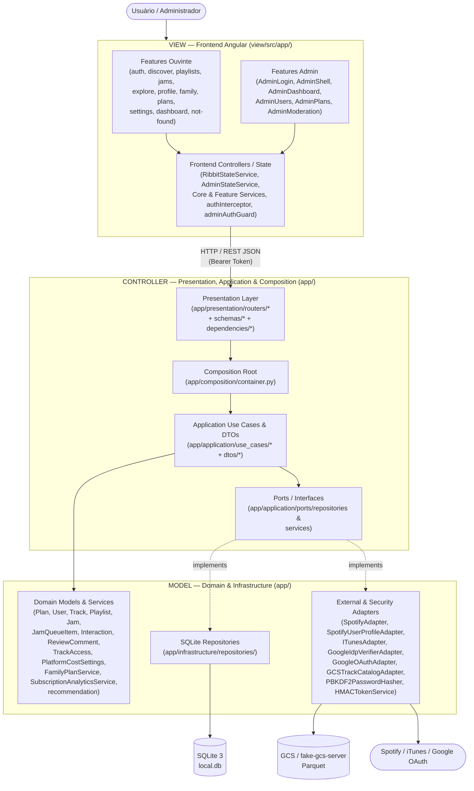

# Diagrama de Componentes (MVC + Hexagonal)

```mermaid
flowchart TB
    User([Usuário / Administrador]) --> View

    subgraph View["VIEW — Frontend Angular (view/src/app/)"]
        ListenerUI["Features Ouvinte<br/>(auth, discover, playlists, jams,<br/>explore, profile, family, plans,<br/>settings, dashboard, not-found)"]
        AdminUI["Features Admin<br/>(AdminLogin, AdminShell, AdminDashboard,<br/>AdminUsers, AdminPlans, AdminModeration)"]
        FEController["Frontend Controllers / State<br/>(RibbitStateService, AdminStateService,<br/>Core & Feature Services, authInterceptor, adminAuthGuard)"]
        ListenerUI --> FEController
        AdminUI --> FEController
    end

    FEController -->|"HTTP / REST JSON<br/>(Bearer Token)"| Presentation

    subgraph Controller["CONTROLLER — Presentation, Application & Composition (app/)"]
        Presentation["Presentation Layer<br/>(app/presentation/routers/*<br/>+ schemas/* + dependencies/*)"]
        Composition["Composition Root<br/>(app/composition/container.py)"]
        UseCases["Application Use Cases & DTOs<br/>(app/application/use_cases/* + dtos/*)"]
        Ports["Ports / Interfaces<br/>(app/application/ports/repositories &<br/>services)"]
        Presentation --> Composition
        Composition --> UseCases
        UseCases --> Ports
    end

    subgraph Model["MODEL — Domain & Infrastructure (app/)"]
        Domain["Domain Models & Services<br/>(Plan, User, Track, Playlist, Jam,<br/>JamQueueItem, Interaction, ReviewComment,<br/>TrackAccess, PlatformCostSettings,<br/>FamilyPlanService, SubscriptionAnalyticsService,<br/>recommendation)"]
        SQLiteRepo["SQLite Repositories<br/>(app/infrastructure/repositories/)"]
        ExtAdapters["External & Security Adapters<br/>(SpotifyAdapter, SpotifyUserProfileAdapter,<br/>ITunesAdapter, GoogleIdpVerifierAdapter,<br/>GoogleOAuthAdapter, GCSTrackCatalogAdapter,<br/>PBKDF2PasswordHasher, HMACTokenService)"]
        UseCases --> Domain
        Ports -.->|implements| SQLiteRepo
        Ports -.->|implements| ExtAdapters
    end

    SQLiteRepo --> DB[(SQLite 3<br/>local.db)]
    ExtAdapters --> GCS[(GCS / fake-gcs-server<br/>Parquet)]
    ExtAdapters --> ExtAPIs([Spotify / iTunes / Google OAuth])
```
